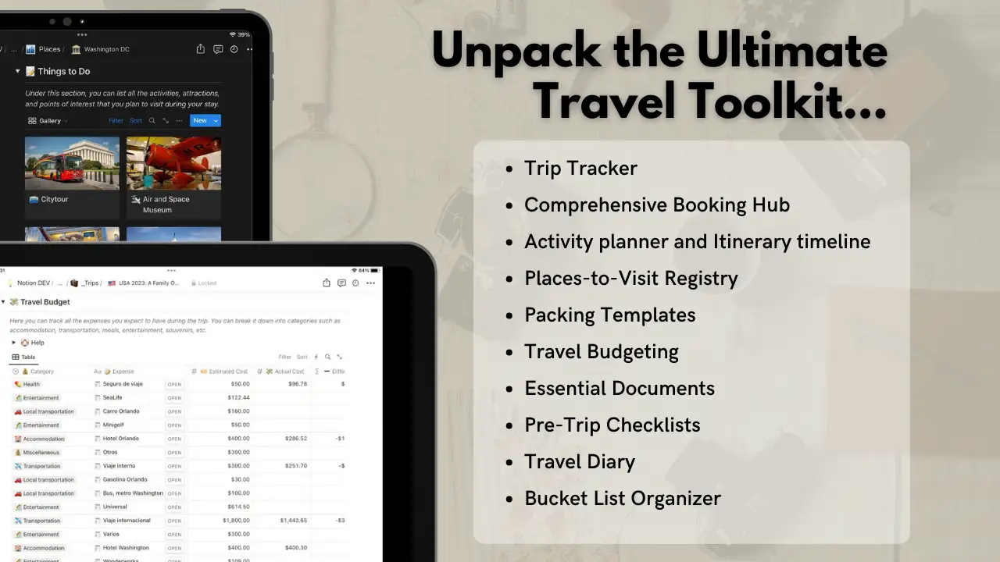

## 🙋‍♂️ Hi!, I'm Ricardo
### a full stack web developer 💻, MBA 🎓 and entrepreneur 🚀 from Panama 🇵🇦

🎯 Seasoned Full-stack Web Developer and Entrepreneur with an MBA and over a decade of remote work expertise, operating efficiently with minimal supervision. Renowned for meticulous analytical skills, strategic insights, and a systematic approach to challenges. Extensive experience in administrative software development, financial processes, and business operations. Showcases a profound background in sales, finance, consulting, and leading financial initiatives that have resulted in significant revenue growth. Brings a unique perspective to roles, driven by a passion for efficient and productive workflows. Proven ability to work effectively with diverse teams across multiple sectors, having represented ministries in international settings and collaborated with global consultancies. Actively committed to community service, further reflecting dedication to leadership and societal contribution. A multidimensional professional, harmonizing technical prowess with holistic interdisciplinary competencies.

# 💼 Work experience

## 📖 Panama Public Records Bureau (Registro Público de Panamá)

### 🖥 Full Stack Developer
📅 sept. 2014 - _current_

- Spearheaded the end-to-end development journey of multiple systems and applications, from requirement identification and strategic planning to comprehensive full-stack development. Led rigorous testing, streamlined CI/CD deployment, hands-on training, dedicated support, and iterative enhancements. Some highlighted projects include:

  - **HR administration system**: Transitioned from paper-based processes to an online system, significantly reducing manual HR registration efforts. Optimized payroll, PTO, leave management and reporting while introducing automated document generation, accelerating departmental operations.

  - **Integration with Biometric Attendance Devices**: Implemented the TCP/UDP communication protocol of these devices in JavaScript to build a REST API, streamlining communication and data capture.

  - **Asset Management System**: Enabled inventory control, asset registration, depreciation calculations, and report generation.

  - **Asset Tracking & Audit Mobile Tool**: Developed an intuitive Android application tailored for PDA barcode scanners, streamlining inventory audits. The solution not only reduced the time taken and minimized errors but also enabled on-the-spot corrections, and the capability to capture images of assets. Seamlessly integrated with the Asset Management System API.

  - **Warehouse management and procurement system**: Standardized product catalogs, optimized request workflows, ensured adequate stock levels, and managed goods received from external vendors.

  - **Employee performance evaluation system**: Facilitated regular assessments, bonus computations, and report creation. Managed personal data including roles, departments, and salaries.

  - **Credit/debit card sales reconciliation system**: Processed transaction files, reconciled over 2000 daily operations, and generated comprehensive reports.

  - **Expense calculator**: Designed and deployed a user-centric online calculator, empowering clients to precisely project their expenses by leveraging the institution's updated fee structure.

- Implemented a private code repository using GitLab CE and set up GitLab Runner on external servers for CI jobs.

- Supervised the maintenance and operation of various servers (Ubuntu, CentOS, RHEL), installing and optimizing services such as Proxmox, Traefik, Samba, N8n, Minio, and more.

## 🚢 Intermaritime Certification Services

### 🖥 Full Stack Developer
📅 dec. 2022 - feb.2023

- Architected a RESTful API to manage MS Word templates and facilitate document generation using those templates in multiple formats derived from the given data.

- Refined the existing backend by optimizing SQL queries, crafting SQL views to simplify the current codebase, and seamlessly integrating with the newly developed API for comprehensive template management and document creation.

- Established DevContainers for various codebases to streamline the onboarding process for new developers, ensuring a consistent development environment.

# 🤖 Technologies
Javascript, Typescript, PHP, Dart, AngularJS, Flutter, Vue, Node.js, Express.js, NestJS, Linux, Docker, MySQL, RabbitMQ, GitlabCI, Nginx, Traefik, SQL, REST, CI/CD.

# 💼 Additional Relevant Experience

- **Founder and Owner**, Rick's, David, Panama | 02/2013 - 12/2021: Full leadership in operational and financial management of the company.
- **Financial Advisor**, Panama Public Records Bureau (Registro Público de Panamá) | 06/2012 - 09/2014: Led a pricing update process that resulted in an annual revenue increase of over $15M.
- **Financial Analyst**, Ministry of Economy and Finance, Panama City | 06/2009 - 06/2012: Actively involved in devising and structuring fiscal reforms and strategic projects.
- **Consultant**, Banco Nacional de Costa Rica | 10/2008 - 12/2008: Developed compensation and performance management models for Branch Managers.

# 🌐 Volunteering

## 🌍 FullStack Panama (Developers Community)
**Founder** _dec. 2020 - current_

- 🤝 Established and manage a dynamic developer community of 120+ members, promoting knowledge sharing and professional growth.
- 📣 Organized periodic online meet-ups to discuss a wide array of industry-related topics and coordinated collaborative efforts, including international trips for continuous learning.

## 🤲💙 Rotary Club of David

- **PR Chair**. _jul. 2023_
- **President**. _jul. 2022 - jun. 2023_
- **President elect**. _jul. 2021 - jun. 2022_
- **Secretary**. _jul. 2020 - jun. 2021_
- **CTO and Webmaster**. _jul. 2020_
- **Youth and Education Chair**. _jul. 2019 - jun. 2020_

## 🤲💙 Rotary International - District 4240 (Costa Rica, El Salvador, Nicaragua and Panama)

- **District Internt and Communications Officer**. _jul. 2023_
- **Disctrict Youth Exchange Chair**. _jul. 2020_
- **District New Generations Service Exchange Chair**. _jul. 2022_
- **District Alumni Chair**. _jul. 2022_

&nbsp;

---

# [📄💾 Download my resume here!](https://github.com/tribal2/my-resume/blob/main/ricardo-tribaldos-full-stack-developer-resume.pdf)

&nbsp;

# 📓 Passionate about Notion!
I'm a huge fan of optimizing workflows and knowledge management with Notion. If you're as enthusiastic about it as I am and you love to travel, check out Journey Master - the ultimate Notion template for organizing your trips. [Elevate your travel planning game here!](https://tribal2.gumroad.com/l/journeymaster-notion-travel-template) 👇

